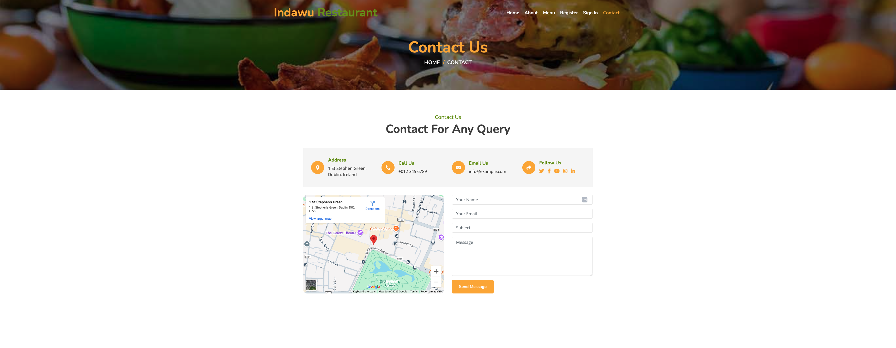
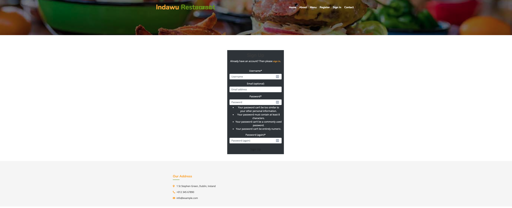

#  Indawu-Restaurant
Indawu-Restaurant is an imaginary Restaurant based in Dublin Ireland created for the Purpose of creating a full functioning Booking app for the school project tollkit Full-Stuck Django milestone Project.

This website displays information to the user such as opening times, Users are able to create an account on this website.Once a user is logged in they are able to make a request for a booking also able to edit or delete their booking by visiting their profile page. An authorized user can also edit the personal profile. The site also have the access for  managers to oversee the bookings of all users so that they can properly run the restaurant.

A live version of the project can be accessed [here:](https://indawu-aba5c792f2e8.herokuapp.com/)

 
## User Experiance Design

## User Demographic

This Site Targes Users who are:

* Looking for an African fusion food taste
* Forigners who live in Dublin and miss their Original Tasete of Food
* Tourists from all over the world who are looking for an international experiance

## User Stories

* As a User of this website I want to see a home page which give me a general information
* As a user of this website I want to create an account so that i can have the access
* As a User of This website I want to  have an access to book or reserve for my comming dates
* As a User I want to see a conformation message so that my booking is accepted for further conformation
* As a User of This website i want to Edit, and delete my booking Schedule
* As a User of this Website I want to edit or delete my usser Profile Information
* As an Admin Of the website i want to access all Bookings and arrange for further management

## Skeleton

## Wireframe
In this project I wanted to explore a new found skill of using bootstrap wireframes. Which I found on https://htmlcodex.com/food-website-template/ but I modified to keep it simple and only have the bare nessecceray screens and pages.

Home

Booking

## Technologies used

* *Django* - The Django framework was used to develop this application.
* *Django AllAuth* - Used to create account, login and logout users of the site.
* *Python* - This application was developed using Python.
* *ElephantSQL* - was used to host the external database.
* *HTML* - was used to develop the templates in this project.
* *CSS* - was used to style the page by customizing it.
* *Lucid chart* - Used to create the flowchart.
* *Bootstrap* - was used for the fast development of the layout and styling
* *Gitpod* - IDE used for the development of the  application.
* *jQuery* - jQuery was used to develop the date and time pickers.
* *GitHub* - The code for this application is stored on GitHub.
* *Git* - Used for version control.
* *Heroku* - Used for development.
* *JavaScript* -

## Features

## Existing features

### Navigation bar

* Links alter depending on which section of the site the user is accessing.
* The navigation bar is seen on all pages of this booking site.
* Navbar toggler appears at screen sizes of 746px or less to preserve well-formatted layout.
* To the left hand side of the navigation bar the name and the logo for café-board can be seen. This logo is clickable and will return the user back to the home page.

### Home Page

* A home page also displaying a quick link to the booking area of the site.
* A home page with a background image displaying the environment of the restaurant.
* A home page renders well for all screen size media.

### Contact Us Page

* The contact us link opens a form for the user to fill out.
* The user is asked for their name, email and the message they would like to send.
* The Booking admin adress all the issues rasied by the user as quickly as possible.

### Register Page

)

* This link allows a User to Sign up for the page and 
* A registerd User has all the access for booking and additional previllages
* A User is expected to fill all the required Fild and a conformation massage will show the Success.

### Sign-in Page

* A user can sign in using a registerd credentials 
* After the user sign in the user can book, visit the profile and able to perform edition and deletion 
* A signd in User have the following Options

### Booking Admin

* An admin area only allowing access to the site admin
* A link to the database to clearly display the details of each booking
* Username and password details must be entered to gain access and able to manage booking

## Future features

1. Adding a menu and gallary page
2. Meal orders  for delivery
3. paying online 
4. Automatic email notifications for admin when customers make bookings and notifications to customers when booking status is updated
5. A forgotten password link

## Testing

### Manual testing

Each section of the website has been tested.Testing different devices and screen resolutions has been conducted using Google DevTools.

#### Navigation Bar

**Test**|**Action**|**Expected**|**Result**
-----|-----|-----|:-----:
Logo|Clicked logo|When the logo is clicked it will return the user to the home page|pass
Home nav link|Clicked Home on the nav bar|When clicked it will direct the user to the home page|pass
Contact-Us nav link|Clicked Contact-Us on the nav bar|When clicked it will direct the user to the Contact-us|Pass
Register nav link|Clicked Register on the nav bar|When clicked it will direct the user to the sign up page|Pass
Sign in nav link|Clicked Sign in on the nav bar|When clicked it will direct the user to the sign in page|Pass
Nav menu responsive|Change the Device Size|When browser is resized the nav bar will remain responsive across all device sizes|Pass

#### Contact Us

**Test**|**Action**|**Expected**|**Result**
-----|-----|-----|:-----:
Contact us form|Filled out form and clicked submit|Once successfully filled out and submitted by the submit button then conformation message will popup|Pass
Contact us form validation|Tried to submit form with empty name input|If the form is submitted with a required field empty a pop up will detail this to the user|Pass
Contact us page responsive|Change the Device Size|When the screen size is changed the contact us page will adapt to the different screen size|Pass

#### Register

**Test**|**Action**|**Expected**|**Result**
-----|-----|-----|:-----:
Sign in link|Clicked sign in link|If the user clicks the sign in link they are redirected to the sign in page|Pass
Register form|Filled out all required fields of register form and clicked sign up|When sign up button is clicked it will create an account for the user and sign them into the site|Pass
Register - success message|Created an account on the register page and observed the success message|When user creates an account they are signed-in a success message is displayed|Pass
Register form validation|Clicked sign up and left the required field blank|If sign up is clicked without a required input field being filled a pop up will detail this to the user|Pass

#### Sign In
**Test**|**Action**|**Expected**|**Result**
-----|-----|-----|:-----:
Sign in form|Fill out all required fields of sign in form and clicked sign in|Once the sign in form is filled out correctly and sign in button is clicked it will sign them into the site|Pass
Sign in - success message|Signed in and observed the success message|When user signs in they are redirected to café-board home page and a success message is displayed|Pass
Sign in page responsive|Resized browser and checked the sign in page at different screen resolutions|When the screen size is changed the sign in page will adapt to the different screen size|Pass

#### Booking

**Test**|**Action**|**Expected**|**Result**
-----|-----|-----|:-----:
Booking form|Fill in booking form and clicked submit|Once the booking form is filled out correctly and submit button is clicked it will direct the user to their profile page|Pass
Booking form validation|Submitting booking form with required field blank|If any of the required fields are left empty a pop up will detail that these fields are required for submission of the form|Pass
Booking - success message|Submitted booking form an observed success message|Submitted booking form an observed success message|Pass
Booking page responsive|Resized browser and checked the booking page at different screen resolutions|When the screen size is changed the booking page will adapt to the different screen size|Pass

#### Logout

**Test**|**Action**|**Expected**|**Result**
-----|-----|-----|:-----:
Logout|Clicked the Logout button|Users can logout of the site by clicking the sign out button, they will be redirected to the logged out home page|Pass
Logout - warning message|Logged out of the site and observed the message|Once logged out a message will detail this to the user|Pass

#### Profile

**Test**|**Action**|**Expected**|**Result**
-----|-----|-----|:-----:
Profile information - edit|Profile information - edit|The user can edit their username or email by clicking the edit button and they will be directed to an edit page|Pass
Edit profile information|Edited username and clicked update user|The user can edit their username or email by filling out the form on the edit user page and clicking update user|Pass
Delete profile|Clicked delete account and clicked delete account again on the modal, tried to sign in using the deleted account details|When the delete account button is clicked a modal will pop up to the user to confirm this action, once delete account is clicked the user will be redirected to the logged out home page with a warning message|Pass
Delete bookings|Clicked delete on a booking|Once the user clicks delete next to a booking the booking will be removed and a warning message is displayed to the user|Pass

### Bugs

**Bug**|**Solution**|**Status**
-----|-----|:-----:
Contact Us not validating correctly|had to add post on the page
The deployed project on Heroku not displaying the Bootstrap/CSS styling as implemented in the code|Connect style.css by correcting typo of 'STATIC_DIRS' to 'STATICFILES_DIRS' in settings.py|Fixed
Auto date and time populating is not working on the booking form|using wiedget and jQuery it populates|Fixed

## Deployment

### Deploying on Heroku

1. Create a Heroku account. 
2. Once logged in, select create a new app.
3. Select an app name and region.
4. Select deployment method by onnecting to github.
5. Find the desired repo.
6. Choose the manual deploy or Enable automatic deploys and select the main branch
7. In the settings tab select reveal config vars. Input the required hidden variables.
8. Deploy

### Fork The Repository
1. Access the GitHub repository.
2. Click on Fork button in the upper right-hand corner.
3. Edit the repository name and description if desired.
4. Click the green create fork button.

### Clone The Repository
1. Go to the GitHub repository
2. Locate the green Code button above the list of files and click it
3. Select if you prefer to clone using HTTPS, SSH, or Github CLI and click the copy button to copy the URL to your clipboard
4. Open Git Bash
5. Change the current working directory to the one where you want the cloned directory
6. Type git clone and paste the URL from the clipboard

7. Press Enter to create your local clone.

## Credits

### Code

* Credit for Daniel Conner providing basic booking model and form codes from his project and Amandeep Kaurfor for walkingthrough the foodzone bookstrap django project 

* Credit for Code Walkthrough Projects
  
## Acknowledgements

I would like to thank my mentor and the Code Institute team and the Slack community.

